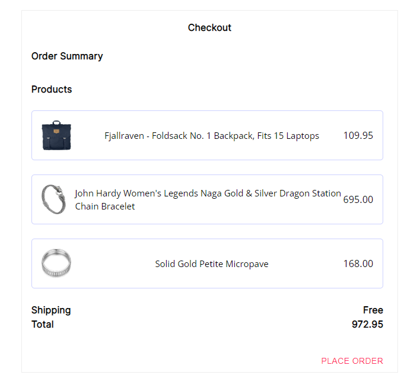

# Welcome to the Big Store!

<strong>Live View:</strong> <a>https://bigstore.gatsbyjs.io/</a> 
<strong>Backend View:</strong> Hosted on <a href="https://glitch.com/edit/#!/big-store-backend">Glitch.com</a>.  
<strong>Api Documentation:</strong> <a href="https://documenter.getpostman.com/view/14742519/2s847HPt3Z">Viewable on Postman</a>

# For Demonstration Purposes Only\*\*

This is a Full Stack application that was built to mimick all of the interactions a user would make with an Ecommerce website. There are no charges that are actually being made and none of the product data is pulled from a real store. Please feel free to play around with the application and add items to your cart and check out. At checkout, you will be emailed an order receipt via Sendgrid's API to the email address you signed up with.

### Features

1. <a href="/auth">Auth</a>
2. <a href="/products">Products</a>
3. <a href="/cart">Cart</a>
4. <a href="/checkout">Checkout</a>
5. <a href="/email">Email</a>
6. <a href="/email">Google Analytics</a>

### Authentication

The authentication was built out using CRUD routes in Express and stored in a MongoDB database. Users sign their ID property with a json webtoken that expires after a certain amount of time.

### Products

Products were pulled from the Fake Store API and mapped out into different components included Cart & Checkout.

### Cart

A modal was built out using React with Material-UI and maps out the cart property of a user object in MongoDB. This includes and add and remove option for products in the cart

### Checkout

Checkout takes the price of all of the items and empties out the cart.

### SendGrid Integration

SendGrid has been integrated successfully and an email template was imported. In order to set up dynamic data, I utilized the Handlebars templating language (ex. {{ name}} ) to import a user's name in the receipt that gets sent out after to the email address that the user signed up with.

### Cypress E2E Testing

Cypress has been installed and configured and an end-to-end test has been written up to go through the entire user flow of logging in all the way to checking out. Currently, there is a 401 error existing that is preventing Cypress from checking out properly. Working on a fix and will add this to a CI/CD pipeline afterwards.

### Planned Features

Google Analytics has been implemented on my portfolio website and will be implemented here to see if user activity is present. Project visuals have been improved greatly but are still underway.
